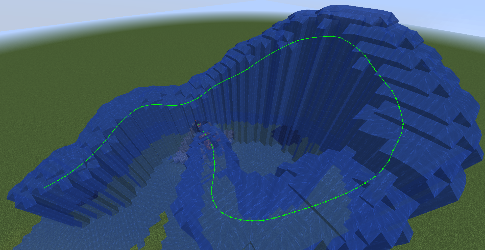
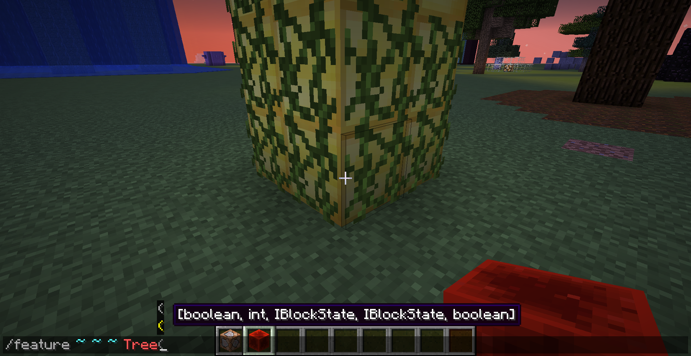

# FeatureHelper

使用命令生成洞穴、结构和地物。仅用于学习和交流。

## 命令格式

```
/structure (start|piece|continue|bb) ...
/carve (start|continue|trail) ...
/feature ...
```

## 画廊

* 水下洞穴：




* 全新的feature命令提示：



---

注意事项：
* 配置环境之前，在gradle.properties中修改你的gradle-user-home
