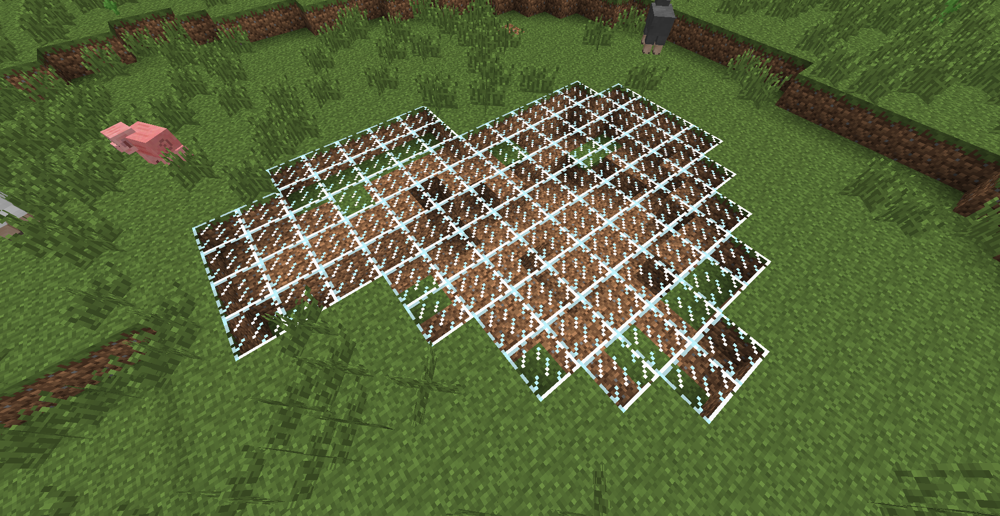

# FeatureHelper

使用命令生成洞穴、结构和地物。仅用于学习和交流。

## 命令格式

结构：
```
/structure start <x> <y> <z> <structureName> [debug] [dataTag]
/structure continue
/structure component <x> <y> <z> <compName> [dataTag]
/structure bb <hide|show>
```

洞穴：
```
/cave start <x> <y> <z> tunnel [yaw] [pitch] [radius] [length] [debug]
/cave start <x> <y> <z> room [radius]
/cave continue
/cave trail <hide|show>
/cavehell start <x> <y> <z> tunnel [yaw] [pitch] [radius] [length] [debug]
/cavehell start <x> <y> <z> room [radius]
/cavehell continue
/cavehell trail <hide|show>
/ravine start <x> <y> <z> tunnel [yaw] [pitch] [radius] [length] [debug]
/ravine continue
/ravine trail <hide|show>
```

地物：
```
/populate <x> <y> <z> <featureName> [args...]
```

## 画廊





---

搭建项目环境之前，你需要：
1. 解压eclipse.zip，如果你使用eclipse开发的话
2. 在gradle.properties中配置你的gradle-user-home
